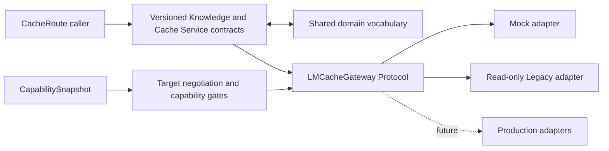

# KDN control-plane architecture

[Back to the CacheRoute overview](../README.md)

## Purpose

The KDN Server architecture combines three control-plane responsibilities:

> **Knowledge Control Plane + CacheRoute Cache Service Facade + LMCache Orchestration Gateway**

It describes knowledge and logical cache state, negotiates what an LMCache endpoint can do, and returns explicit outcomes to CacheRoute callers. It is **not** another remote KV server, an LMCache Token Database or StorageManager replacement, or part of the direct vLLM/LMCache KV hot path. Existing operational KDN code remains separate from the new contracts and adapters.

## Architecture overview

`CapabilitySnapshot`, compatibility negotiation, and operation outcomes are control-plane concerns. Cache payload movement remains an LMCache responsibility.

## Directory map

- [`domain/`](domain/README.md) — stable `CacheArtifact`, `CacheReplicaObservation`, `LMCacheEndpoint`, `CacheOperationTask`, `QueueWork`, identifiers, freshness, states, and transitions.
- [`contracts/`](contracts/README.md) — versioned Knowledge Service and Cache Service envelopes, request/response families, token references, outcomes, and safe structured errors.
- [`gateway/`](gateway/README.md) — profiles, composed adapter bindings, `CapabilitySnapshot`, negotiation and capability gates, `LMCacheGateway`, factory, Mock Gateway, and Legacy adapter.
- [`../test/kdn/`](../test/kdn/README.md) — CPU-only domain, contract, security, and adapter workflow tests.

## Normal control-plane workflow

1. Resolve `RuntimeProfile` at startup; never persist `auto`.
2. Discover an immutable `CapabilitySnapshot`.
3. Select an explicit compatibility profile, endpoint, and generation.
4. Construct a versioned request.
5. Negotiate Runtime/Profile/Endpoint/Generation.
6. Gate the requested operation using its tri-state capability.
7. Return the dedicated structured response type.
8. Handle `stale`, `incompatible`, `unsupported`, and fallback outcomes explicitly.

## Current implementation status

### Implemented

- versioned, frozen, storage-neutral contracts;
- immutable capability and compatibility models;
- deterministic CPU-only Mock Gateway and operation lifecycle simulation;
- explicit read-only Legacy adapter;
- structured errors, idempotency conflicts, and text fallback;
- contract boundaries that reject secrets and physical KV representations.

### Intentionally not implemented

- production MP HTTP, Coordinator, or SDK Gateways;
- actual LMCache prefetch, pin, unpin, clear, or rebuild I/O;
- Redis, filesystem, or LMCache production I/O in the new adapters;
- placement, admission, scheduling, trace, or later-Issue policy work.

## Continue reading

Read the [domain vocabulary](domain/README.md), [wire contracts](contracts/README.md), [Gateway architecture](gateway/README.md), then run the [CPU-only workflows](../test/kdn/README.md).
